# CSS

## CSS의 간단한 설명
- 스타일 시트 언어
- 폭포수, 계단식으로 작동하는 스타일 설정
- HTML 요소를 선택하고 선택한 요소에 대한 스타일을 지정
- 사이트의 모양, 레이아웃, 색상 지정 가능

## CSS 특징
- 외부 파일에서 불러와 HTML 파일에 적용할 수도 있고, HTML 파일 내부에서 직접 스타일을 지정할 수도 있음
- 캐스캐이딩(cascading)이라는 개념을 사용하여, 여러 스타일 규칙이 적용될 경우 우선순위를 결정
- 한 요소에 대해 여러 스타일 규칙이 적용될 경우, 가장 구체적인 스타일이 적용

- 장점 : 일관성 있고 전문적인 디자인을 구현 가능

## CSS 적용 
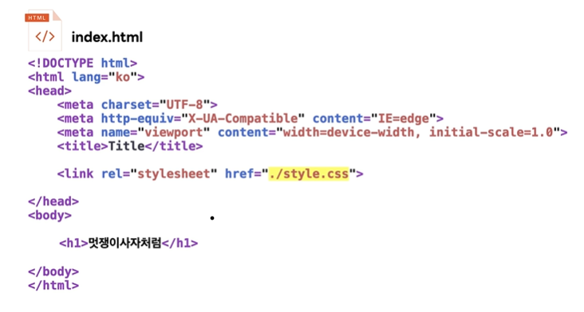
- <link> 사용
- 주의 할 점 : html과 같은 파일 경로에 css파일이 있는지 확인 해야 함

## 일반적인 속성

- font-family: 글꼴을 지정
- font-size: 글꼴 크기를 지정
- color: 글꼴 색상을 지정
- background-color: 배경 색상을 지정
- width: 너비를 지정
- height: 높이를 지정
- border: 테두리 스타일을 지정
- margin: 바깥쪽 여백을 지정
- padding: 안쪽 여백을 지정

## Box_Sizing
- 박스에 적용된 사이즈의 기준 정하기

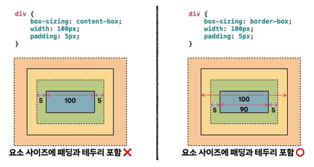
- content-box : 내용이 차지하는 영역에만 사이즈가 적용
    > 단점 : 위의사진 처럼 생각했던 요소의 크기 보다 크게 나올 수 있음
        -> 해결 방법 : universal selector로 전체적용
        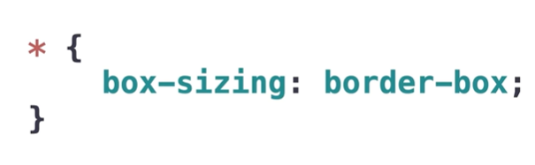
        
- border-box : 테투리, 내용 포함해서 하나의 사이즈로 적용
               왜곡 되지않은 사이즈로 뽑을 수 있음

## CSS 기본 구조
- 선택자(selector)
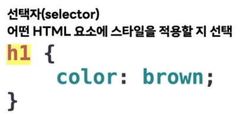

- 속성(property) 
 > html이랑 영어가 다름, 영어 조심할 것
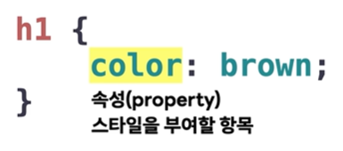

- 값(value)
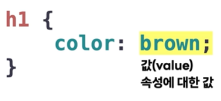

- 선언(delaration)
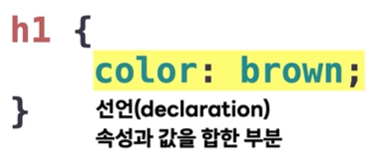

- 규칙(rule)
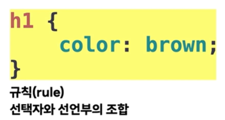

- 요소 전체에 적용(universal)
 > 단점 : 부분적으로 수정할 때 곤란한 상황이 생김
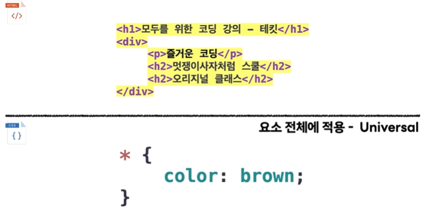

- 특정 태그 전체에 적용
> 단점 : 다른 곳에 같은 헤드를 썼을 떄 중첩되어 변경 될 수 있음
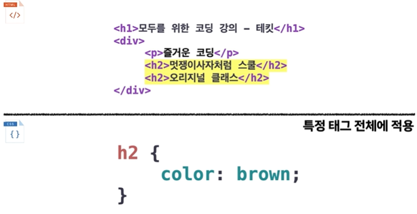

- 여러 태그 전체에 적용
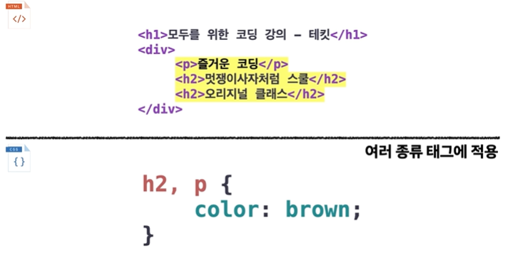

-특정 클래스에 해당되는 요소에 대해 적용
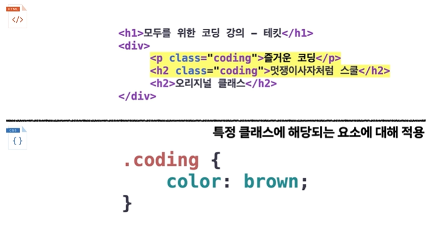

