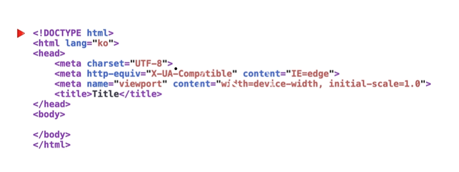
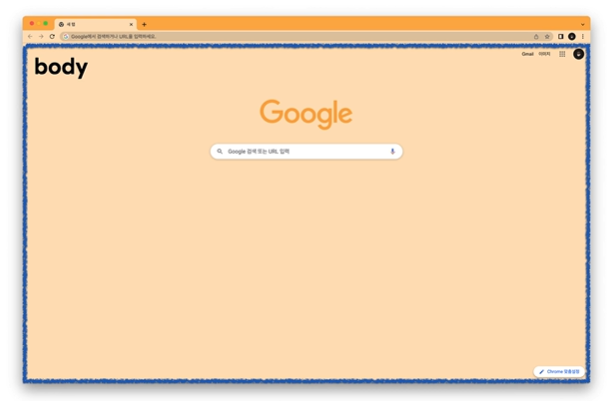

# html 

## html의 간단한 설명
- 텍스트에 생명을 불어넣는 것
- 구조/내용을 다룸

## HTML요소(element)
  - 텍스트 조각
  - 태그를 붙이는 작업 markup
  - 뒤에오는 태그에는 /를 붙여주기

 > 자주 사용되는 요소

     
: 문단
     <a>: 링크(anchor)를 나타내며, href 속성을 사용하여 링크 대상의 URL을 지정
     : 이미지를 나타내며, src 속성을 사용하여 이미지 파일의 경로를 지정
           > div로 마크업 후 사용  
            src ="경로"  
            alt ="대체 문구"  
     <li> : 목록을 나타내는 것
     <ul>: 번호가 없는 목록(unordered list)을 나타내며, <li> 요소를 포함
     <ol>: 번호가 있는 목록(ordered list)을 나타내며, <li> 요소를 포함
     <table>: 표(table)를 나타내며, <tr> 요소를 포함하고 각 행(row)은  <td> : 요소를 포함
     <h1 ~ 6> : 제목
      : 텍스트의 일부분만 영향을 주기 위해 사용, 의미를 부여하지는 않음
     
 : 여러가지 HTML 요소를 묶어 그룹화 
  
## HTML속성(attribute)
  - 요소(element)에 대한 추가 정보를 제공
  - 일반적으로 태그의 시작 부분에 작성

> 일반적인 속성

     class: 요소를 그룹화하거나 스타일 적용에 사용하는 클래스 이름을 지정
     id: 요소의 고유한 식별자를 지정
     style: 요소에 스타일을 적용하기 위한 CSS 코드를 지정
     title: 요소에 대한 추가 정보를 제공하는 툴팁을 지정
     href: 링크 요소에서 링크 대상의 URL을 지정

## HTML주석
- 작성은 되어있는 코드를 브라우저 화면에 뜨지않도록 하는 것
- ctrl + /

> 조심해야할 점
     브라우저에 뜨지않는다고 남용하지 말 것
     주석을 포함한 모든 내용을 받아감   
     이유 -> 주석처리를 한 개인정보 등 중요한 것이 브라우저를 통해 노출 될 수 있기 때문!

## HTML head
### 이미지 추가 설명

#### !DOCTYPE html
- html문서라는 것을 선언해주는 것

#### html lang="ko"
- 이 html이 무슨 언어로 되었는지 알려주는 것

#### head
- 브라우저 화면에 안나타남
- 웹문서의 속성, 인코딩 방식, 외부 리소스를 로드하는 설정 같은 성격

#### meta charset="UTF-8"
- meta 태그는 여러개 있을 수 있고 안에 있는 attribute에 따라 용도가 달라짐
- utf-8은 다른 언어가 깨지는 걸 막아줌

#### meta http-equiv="X-UA-Compatible" content="IE=edge"
- 브라우저 호환성을 맞춰주는 용도
- 왜냐하면 버전에 따라 같은문서를 다르게 해석한 적이 있기 때문

#### nama="viewport" content-"width=device-width, initial-scale=1.0"
- 기계에 따라 너비를 맞추기 위함

#### title
- <title> 제목 </title>

## HTML은 블록과 인라인 요소로 나뉜다

### 이미지 추가 설명

### 블록 요소
- 브라우저에서 하나의 면을 차지하는 것
- 대표 예시 h, p, ol, ul, li, div

### 인라인 요소
- 특정 텍스트 영역에만 영향을 미침
- 선을 그린다고 생각
- 대표 예시 a, span

## HTML body

### 이미지 추가 설명

### 줄바꿈
- br : line break, 문장 사이에 넣으면 줄바꿈이 됨 (단일 태그)

### 링크 연결
- a : href와 함께 사용하여 연결할 링크 나타냄 (a href="링크" ~~ /a)

