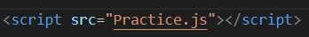
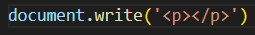

# JavaScript

## 정의

  - 자바스크립트(JavaScript)는 객체(object) 기반의 스크립트 언어\
  - 웹의 동작을 구현

## 특징

  - 자바스크립트는 객체 기반의 스크립트 언어
  - 자바스크립트는 동적이며, 타입을 명시할 필요가 없는 인터프리터 언어
  - 자바스크립트는 객체 지향형 프로그래밍과 함수형 프로그래밍을 모두 표현

## 자바 VS 자바스크립트

## 자바 Script 태그

- 웹 브라우저에서 실행될 때 현재 문서에 새로운 HTML 요소를 추가하는 코드

- HTML 파일에 그림과 같이 작성

- JavaScript 파일에 그림과 같이 작성

- HTML에서 로드 되는 위치가 중요함
- 일반적으로 body 마지막 부분
    - 중간에 Script를 쓰게 되면 기존에 진행 되던 파싱 작업이 중지 되기 때문에

## 변수

- 값을 저장하고 참조할 수 있는 식별자
- 값의 유형에 따라 자동으로 유형이 결정
    -  JavaScript에서는 동적 타입(dynamic typing)을 사용하기 때문
- "var", "let", "const"

- "var"
  - 예전부터 사용되어온 변수 선언 키워드입니다. 하지만 이제는 잘 사용하지 않습니다.

- "let"
  - 블록 유효 범위(block-scoped)를 가지는 변수를 선언할 때 사용합니다. 
  - 이전에는 var로 변수를 선언하면 전역(global) 유효 범위를 가지기 때문에 예기치 않은 문제가 발생하기도 했는데, let을 사용하면 해당 블록에서만 유효하기 때문에 코드의 가독성과 안정성을 높일 수 있습니다.

- "const"
  - 상수(constant)를 선언할 때 사용합니다. 한 번 할당된 값은 변경할 수 없습니다

## DOM

- 정의
  - 웹 페이지의 문서(document)를 나타내는 계층적인 객체 모델
  - HTML, XML 등의 문서를 프로그래밍적으로 조작할 수 있는 방법을 제공

- 트리 구조로 이루어져 있음
  - 문서의 각 요소(element), 속성(attribute), 텍스트(text) 등을 객체(object)로 표현
  - 객체들은 자바스크립트를 사용하여 동적으로 생성하고 수정

- 웹 페이지의 요소들을 계층적으로 구성
  - 요소들 사이의 관계와 위치를 파악

- 웹 브라우저에서 내부적으로 사용
  - 자바스크립트를 통해 외부에서도 접근
  - 웹 페이지를 동적으로 조작하거나, 사용자 입력에 따라 웹 페이지를 변경

## 이벤트

- 정의
  - 이벤트(event)란 웹 페이지에서 발생하는 모든 동작

- 종류
  - 마우스 이벤트: click, dblclick, mousedown, mouseup, mousemove 등
  - 키보드 이벤트: keydown, keyup, keypress 등
  - 폼(form) 이벤트: submit, reset, focus, blur 등
  - 윈도우(window) 이벤트: load, unload, resize, scroll 등