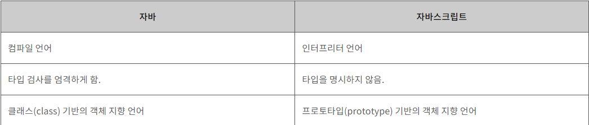

# JavaScript

## 정의
  - 자바스크립트(JavaScript)는 객체(object) 기반의 스크립트 언어\
  - 웹의 동작을 구현

## 특징

  - 자바스크립트는 객체 기반의 스크립트 언어
  - 자바스크립트는 동적이며, 타입을 명시할 필요가 없는 인터프리터 언어
  - 자바스크립트는 객체 지향형 프로그래밍과 함수형 프로그래밍을 모두 표현

## 자바 VS 자바스크립트

